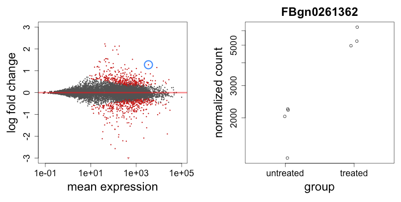

# shiny clickable plots

- the shiny app in `mtcars_demo/` is a general example of two plots, which react
  to clicking on points in the first plot
- the shiny app in `DESeq2_plotMA_plotCounts/` provides an MA-plot on
  the left, and a plot of counts for a single gene on the right. the
  gene is selected by clicking on the MA-plot.

**Note** (24 July 2014): second demo only works with Bioc devel branch bc it uses
`DESeq2::plotCounts` which is in the devel branch 

For more info: look up the help page for `shiny::plotOutput`,
specifically the **clickId** and **hoverId** arguments.

These arguments were suggested and added in this thread:
https://groups.google.com/d/msg/shiny-discuss/0B8VFC9XK4o/bf_SWVnxi-sJ 

**Next ideas** highlight gene sets

**Issues** need to know the xlim and ylim of the plot and whether log-scale
